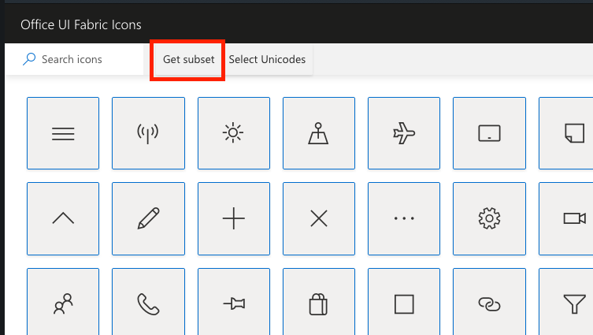

# Office Fabric Icons

This repository is maintained to allow the import of [Office Fabric Icons](https://uifabricicons.azurewebsites.net/) into the [react-native-vector-icons](https://github.com/oblador/react-native-vector-icons). Since Microsoft dont provide the TTF and CSS file in an easy way.

## Steps to update this repository 

1. Acess the `Office Fabric Icons` [website](https://uifabricicons.azurewebsites.net/), select all the available icons. (click at any icon and press `CTRL+A` or `CMD+A`)

2. Click at the `Get subset` to generate and download the `zip` bundle.

3. Unzip the bundle file and replace the content of this repository.

4. Convert the `fonts/fabric-icons.woff` to TFF, and place into `fonts/fabric-icons.ttf`. (you can use any online tool for this, like https://convertio.co/pt/woff-ttf/)

5. Done! 🎉

## Thanks to

- [@willianrod](https://github.com/willianrod)
- [@douglasjunior](https://github.com/douglasjunior)
